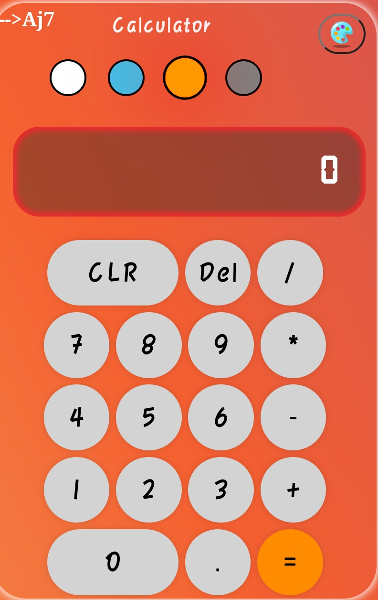

<h1 align="center"> calculator </h1>
<div align="center">

[](https://opensource.org/licenses/MIT)


</div>

### Simple Calculator

- It is a simple web based Calculator App written in HTML JavaScript and CSS.
<div align="center">

Default-Theme                 |   Light-Theme
:-------------------------:|:-------------------------------:
  |   |

</div>

- It is Functionality Calculator and with theme option

-------

#### Live Demo [here](https://calculator-aj.pages.dev)

<details>
<summary> Images </summary>


Theme-1                 |   Theme-2
:-------------------------:|:-------------------------------:
  |   |

</details>

### You can Setup on your Own Environment

> Clone this Repository

``` shell
git clone https://github.com/Aj-Seven/calculator.git
```
#### Now Install Dependecies

<details>
<summary> Attention </summary>

- You need to install the node and npm latest version.

</details>

``` shell
npm install -g live-server
```
> Now goto cloned Repository

``` shell
cd calculator
live-server
```
- It will open-up the link in the browser.

> [localhost](http://localhost:8080)

#### Or You can setup on browser without terminal Environment Required.

> Download Entire Code.

> Open the index.html in the browser by selecting the file.
-------

<h4> Make Changes As you Like Without Asking any permissions for this Repository. </h4>

<h2> <a href="LICENSE"> LICENSE MIT </h2>
